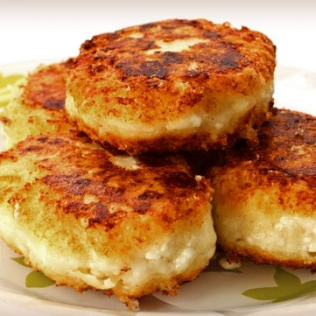

Originali frittelle di fiocchi di latte, soffici e cotte in padella

Ingredients
===========

* 450gr di fiocchi di latte
* 128gr di farina
* 4 uova
* 1tsp lievito in polvere
* un pizzico di sale
* la punta di un cucchiaino di bicarbonato
* 2tbsp burro

Preparation
===========

Sciogliere il burro in una padella.

In una ciotola mescolare insieme tutti gli ingredienti secchi: farina, bicarbonato, sale e lievito.

In un'altra ciotola, sbattere le uova e aggiungere i fiocchi di latte.

Unire le uova e gli ingredienti secchi poi aggiungere il burro fuso. Mescolare.

Con un cucchiaio prelevare delle palline di impasto e disporle nella padella utilizzata per sciogliere il burro.

Cuocere finché non compariranno delle bollicine sulla superficie.

Notes
=====
