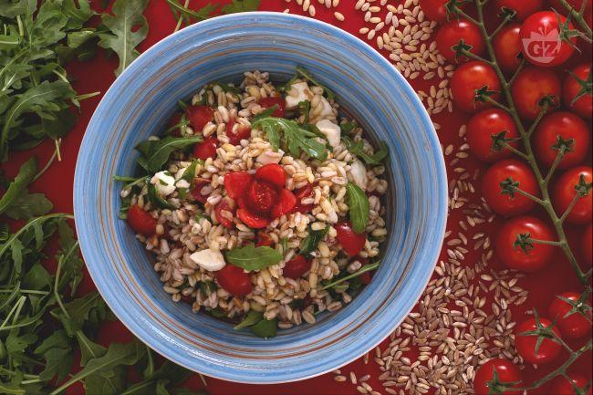

L'insalata di farro e orzo estiva è un'idea fresca, molto leggera e digeribile per preparare i cereali.

Un piatto ricco di fibre e povero di grassi grazie alla presenza del farro e dell’orzo, due cereali molto versatili in cucina.

Per realizzare questa ricetta abbiamo scelto il farro e l’orzo perlati, ovvero privati della pellicola che avvolge i chicchi, che richiedono un tempo di cottura inferiore. Una volta lessati, i cereali si condiscono con pomodori, mozzarelline e rucola, il risultato che si ottiene è una pietanza completa, saporita e colorata.

L'insalata di farro e orzo estiva per la sua semplicità di esecuzione e per la sua freschezza è ideale da consumare freddo anche in spiaggia oppure da portare con sè per dei pic nic estivi,  da servire come primo piatto o piatto unico.				 						

Ingredients
===========

* 150gr Orzo perlato
* 150gr Farro perlato 
* 30gr	Rucola
* Sale q.b.
* Olio di oliva q.b.
* 200gr Pomodori ciliegino 
* 100gr	Mozzarella ciliegine 

Preparation
===========

Per realizzare l’insalata di farro e orzo estiva iniziate lessando i cereali: ponete in una pentola capiente l'orzo (1) e il farro perlati (2)  aggiungete abbondante acqua salata fino a ricoprire i cereali (3) e lessateli seguendo le indicazioni sulla confezione (solitamente hanno bisogno di circa 15-18 minuti di cottura);

Una volta cotti avranno assorbito parte dell'acqua  (4), scolateli e passateli sotto acqua fredda corrente in modo da bloccare la cottura e raffreddarli (5); trasferiteli in una ciotola capiente e tenete da parte. Occupatevi ora dei pomodori: lavateli sotto l’acqua corrente e tagliateli a piccoli spicchi (6), eliminate l’acqua di conservazione dei bocconcini di mozzarella e tagliateli a dadini (7). Mondate la rucola e sciacquatela bene sotto l'acqua; tritate grossolanamente anche le foglie di rucola (8). A questo punto prendete la ciotola con i cereali e unite i pomodorini (9), le mozzarelline (10) e la rucola (11). Irrorate con abbondante olio extravergine di oliva (12) ed eventualmente regolate di sale (13) . Mescolate con un cucchiaio in modo che i cereali si insaporiscano con il condimento (14). La vostra insalata di farro e orzo estiva è pronta per essere gustata (15) e servita fredda.							

Notes
=====

## Conservazione						

Conservate l’insalata di farro e orzo estiva in frigorifero per un paio di giorni coperta da pellicola. Si sconsiglia la congelazione.

## Consiglio								

L’insalata di farro e orzo estiva si presta ad innumerevoli varianti, ecco qualche suggerimento: la rucola può essere sostituita dal songino, potete inoltre aggiungere verdure croccanti ad esempio una julienne di carote, peperoni o finocchi e per quanto riguarda il formaggio potete utilizzare dell’emmentaler al posto della mozzarella se amate i gusti più decisi.

												

