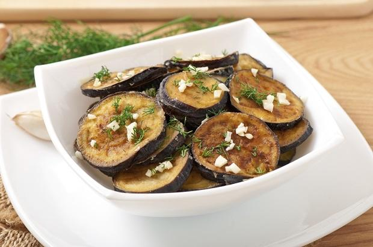

Le **melanzane a funghetto** sono un contorno sfizioso e saporito che fa parte della tradizione della **cucina campana**, sono buonissime e versatili e si possono gustare calde, a temperatura ambiente e anche fredde. Le **melanzane** sono uno degli ingredienti più versatili, si possono preparare in tanti modi diversi, tra le ricette più famose ricordiamo[ la Parmigiana](http://www.gustoblog.it/post/25019/le-melanzane-alla-parmigiana-con-la-ricetta-tradizionale-napoletana) e[ la pasta alla norma](http://www.gustoblog.it/post/28613/la-pasta-alla-norma-con-la-ricetta-originale-siciliana). Vediamo insieme come fare le **melanzane a funghetto con la ricetta light**, limitando la quantità di olio e di formaggio.

Ingredients
===========

* 600gr melanzane
* 300gr di pomodori freschi
* Olio extravergine di oliva
* Sale
* Pepe
* 2 spicchi di aglio
* Una manciata di olive nere
* Un cucchiaino di capperi
* Basilico
* Pinoli

Preparation
===========

[Lavate le melanzane](http://www.gustoblog.it/post/131629/le-melanzane-grigliate-alla-parmigiana-per-il-secondo-leggero), spuntatele e poi tagliatele a cubetti. Sbucciate l’**aglio** e poi lavate anche i **pomodori**, tagliateli a pezzi e teneteli da parte. Prendete una **padella antiaderente** e mettete 3 cucchiai di **olio** e le melanzane, unite l’aglio e il **sale** e **cuocete** a fuoco dolce per circa 15 minuti mescolando molto spesso con un cucchiaio di legno.

A questo punto potete incorporare i pomodori e insaporire con **olive** denocciolate, **capperi**, sale, **pepe** e **basilico**, mescolate e cuocete per circa 20 minuti. Se vedete che le melanzane si asciugano troppo potete aggiungere qualche cucchiaio di acqua.

Tostate i pinoli in padella e uniteli alle melanzane, mescolate e servite. Dato che abbiamo usato poco olio potete aggiungerne un cucchiaio a crudo alla fine della cottura.

Le melanzane a funghetto si possono fare anche senza pomodoro, in questo caso aromatizzate a piacere e insaporite con olive e capperi e poi aggiungere una generosa manciata di **prezzemolo** tritato. Se volete potete completare la ricetta con un po’ di **parmigiano reggiano grattugiato**.

Notes
=====
