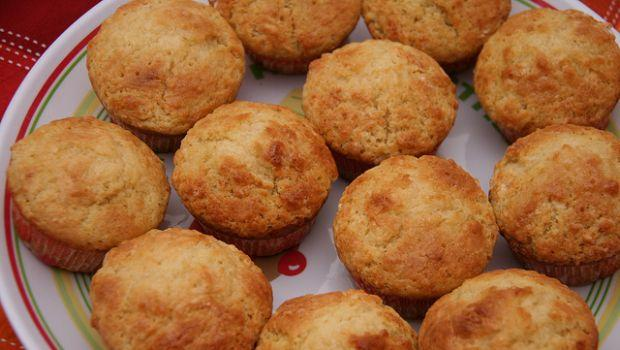

Nonostante il mio amore spassionato per la[ cioccolata](http://www.gustoblog.it/categoria/ricette-cioccolato) e tutti i possibili dolci che possano contenerla, a volte mi stupisco nel trovare dei[ dessert](http://www.gustoblog.it/categoria/dolci) che possano metterlo in discussione. I **muffin al limone e ricotta** sono dei dolcetti che adoro letteralmente. Così soffici e profumati, così leggeri da non appesantire pur appagando la voglia di qualcosa di goloso.

Facili e veloci possono essere preparati anche prima di colazione, per essere gustati subito dopo essere stati sfornati, anche se si matengono morbidi a lungo. Ecco la **ricetta**.

Ingredients
===========

* 250gr di farina
* 125gr di zucchero
* 70gr di burro fuso
* 100gr di ricotta
* 70gr di latte
* succo di un limone
* 1/2 bustina di lievito per dolci
* 2 uova

Preparation
===========

Versare la farina in una ciotola, unire lo zucchero ed il lievito quindi aggiungere anche il burro precedentemente fuso e freddo e il latte, le uova, la ricotta quindi mescolare bene. Unire per ultimo il succo di limone. Ottenuto un composto omogeneo versarlo negli appositi stampini riempiendoli per 2/3 quindi cuocere in forno caldo a 180 °C per circa 20 minuti. Una volta cotti sfornarli e spolverarli con dello zucchero a velo.

Notes
=====
