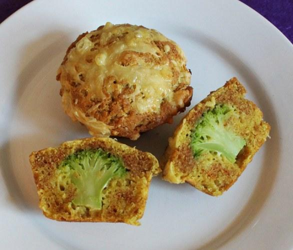

Ingredients
===========

* 250gr di farina 00
* 250gr di cimette di broccoli lesse
* 150gr di mozzarella
* 50ml di olio di semi
* 50gr di parmigiano grattugiato
* 2 uova
* latte qb
* 1/2 bustina di lievito in polvere per torte salate
* sale

Preparation
===========

Versare in una ciotola le uova, l’olio, unire il parmigiano grattugiato, un pizzico di sale ed amalgamare bene. Aggiungere la farina setacciata con il lievito mescolando bene per evitare la formazione di grumi quindi unire anche la mozzarella tagliata a cubetti e se l’impasto dovesse risultare troppo denso un paio di cucchiai di latte. Versare il composto nei pirottini, riempiendoli per metà quindi, posizionare all’interno di ognuno di essi una cimetta di cavolfiore lessa. Cuocere in forno caldo a 180 °C per circa 20 minuti.

Notes
=====
