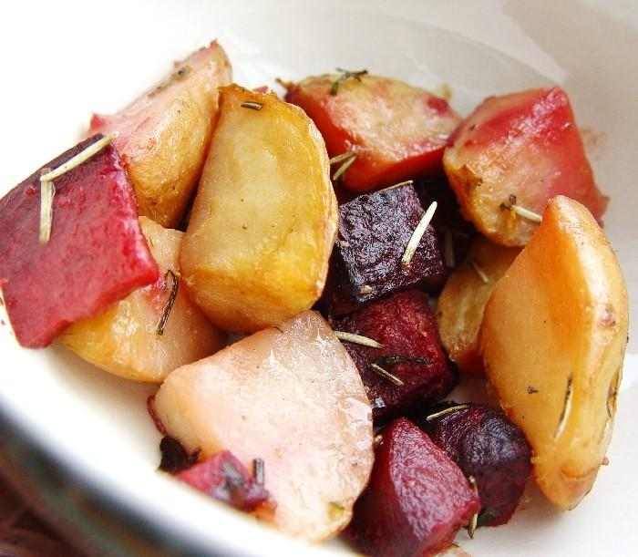

Oggi prepariamo un gustoso **contorno** di **patate e barbabietole al rosmarino** con un tocco di peperoncino. La cottura di questo insieme di **verdure** è al forno, in carta stagnola chiusa in cartoccio per favorire una ottimale cottura del contorno. Il rosmarino e il peperoncino sono molto importanti per conferire un gustoso sapore a patate e barbabietole. In questa ricetta, al contrario di molte preparazioni,[ utilizzeremo le barbabietole crude e non cotte](http://www.buttalapasta.it/tag/ricette-barbabietola/).				

Ingredients
===========

* 800gr di patate novelle (preferibilmente piccole)
* 200gr di barbabietole
* 100gr di cipolle rosse
* Peperoncino
* Rosmarino
* Olio di oliva
* Sale		

Preparation
===========

1. Lavate per bene le patate eliminando tutti i residui di terra dalla buccia. Se le **patate** sono abbastanza piccole lasciatele intere, altrimenti tagliatele a cubetti grossi.

2. Poi asciugatele.  

3. Sbucciate le barbabietole e tagliatele a dadini, poi sbucciate la cipolla e affettatela a rondelle. Ora disponete le patate, le barbabietole e le cipolle in un foglio di alluminio su carta da forno in una pirofila da forno. Condite con un pizzico di sale, **peperoncino** e abbondante rosmarino.  

4. Cospargete patate e barbabietole con un filo di olio, mescolate e chiudete la carta alluminio. Infornate in forno preriscaldato a 180°C per circa 1 ora. Servire il **cartoccio di patate** e barbabietole al rosmarino in un piatto da portata.

Notes
=====

