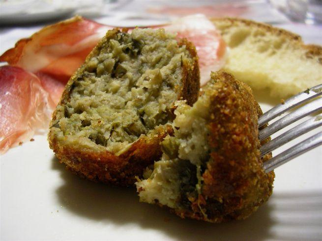

Le **polpette di melanzane** sono una bontà che possiamo gustarci sempre: sono perfette per un secondo piatto vegetariano o per un contorno più gustoso, che magari piace anche ai bambini (in tal caso meglio la cottura in forno e non la frittura), ma possono diventare anche uno sfizioso antipasto o un aperitivo facile da preparare.

Potete prepararle quando volete e possono anche essere consumate tiepide o fredde, così da diventare il piatto perfetto da portare con noi al mare, al lavoro, per un pic nic...

Ingredients
===========

* 1kg di melanzane
* 2 uova
* 1 spicchio di aglio
* parmigiano grattugiato
* pangrattato
* foglie di prezzemolo
* sale
* Pepe
* olio per friggere

Preparation
===========

Togliete la buccia alle melanzane e tagliatele a pezzi.

Cospargete le melanzane di sale e mettetele nello scolapasta a perdere tutta l'acqua.

Sciacquate le melanzane e lessatele in acqua bollente. Scolatele e strizzatele.

Pulite, lavate e tritate il prezzemolo e l'aglio.

In una ciotola mettete la polpa delle melanzane, le uova, il formaggio grattugiato, l'aglio e il prezzemolo.

Salate e pepate.

Mescolate tutto e mettete l'impasto a riposare in frigo per un'ora.

Formate delle polpette, passatele nel pangrattato e friggetele in olio caldo.

Mettete in un piatto con carta da cucina, spolverate di sale e servite.

Notes
=====
