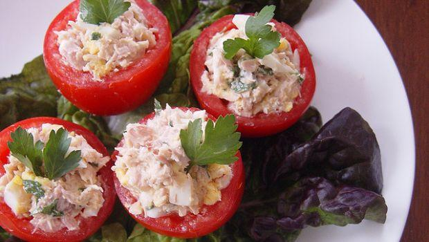

E dopo avere preparato i[ peperoni ripieni di tonno](http://www.gustoblog.it/post/94977/come-fare-i-peperoni-ripieni-di-tonno-al-forno?utm_source=feedburner&utm_medium=feed&utm_campaign=Feed%3A+Gustoblog%2Fit+%28gustoblog%29) questa è stata la volta dei pomodori, non cotti al forno però ma mangiati a crudo, per una **ricetta light** adatta all’estate. Per ottenere un ripieno cremoso ed allettante nonostante le poche calorie ho utilizzato anche del formaggio fresco cremoso. Ritengo che i **pomodori ripieni di tonno** siano già abbastanza leggeri così ma nel caso in cui vogliate ridurre ulteriormente le calorie potete utilizzare del tonno al naturale e del formaggio light.

I pomodori ripieni di tonno rappresentano una pietanza ideale da portare in tavola durante i pranzi e le cene estive. Ottimi sia come sfizioso antipasto che come leggero secondo piatto. Facili e veloci da preparare sono pronti in pochi minuti e si conservano in frigo fino al momento di essere serviti. Se amate le preparazioni di questo tipo[ non perdete la variante cotta al forno e ripiena di cous cous.](http://www.gustoblog.it/post/10241/i-pomodori-ripieni-di-cous-cous-al-forno-con-tonno-e-prezzemolo)

Ingredients
===========

* 8 pomodori
* 250gr di philadelphia
* 160gr di tonno sott’olio
* 70gr mais in scatola
* prezzemolo fresco

Preparation
===========

Lavare i pomodori, tagliare la calotta superiore e svuotare l’interno. Metterli a sgocciolare a testa in giù su un piatto. Nel frattempo aprire le confezioni di tonno e sgocciolarlo. Sminuzzarlo e versarlo in una ciotola. Unire il formaggio fresco, il mais ed il prezzemolo. Mescolare bene fino ad ottenere un composto omogeneo e riempire i pomodori. Servirli freddi su un letto di insalata.

Notes
=====
