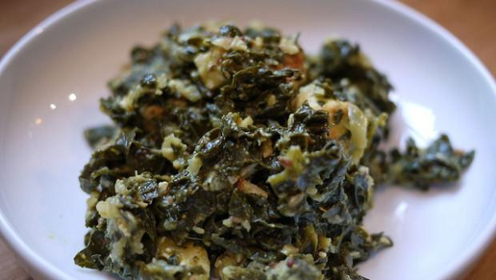

Rieccoci con una ricetta a base di spinaci. Grazie ad una vicina di casa che non manca mai di viziarmi con i suoi doni culinari, questa è stata, in casa mia, la settimana dedicata a questa verdura a foglia verde così amata, tanto da avere avuto la possibilità di utilizzarla per la preparazione di diverse pietanze; tra queste gli **spinaci con mozzarella e pancetta.**

Ricetta dedicata agli amanti dei piatti filanti (la mozzarella, una volta cotta, lo diventa in maniera irresistibile), gli spinaci con mozzarella e pancetta risultano saporiti e perfetti anche nei casi in cui si abbia poco tempo da dedicare ai fornelli, perchè magari rincasati troppo tardi. Altre ricette con gli spinaci sono il[ tortino di spinaci e speck](http://www.gustoblog.it/post/9335/il-tortino-di-spinaci-e-speck) ed il[ pesto di spinaci](http://www.gustoblog.it/post/9247/la-ricetta-del-pesto-di-spinaci), che all’occorrenza può essere congelato.

Ingredients
===========

* 1kg di spinaci
* 200gr di mozzarella
* 100gr di pancetta affumicata a cubetti
* 50gr di parmigiano
* olio extra vergine di oliva
* sale e pepe

Preparation
===========

Lavare gli spinaci quindi, senza scolarli troppo, trasferirli in un tegame e cuocerli per 10 minuti. Prelevarli dalla padella, strizzarli e sminuzzarli. Adesso in una padella versare poco olio e farvi soffriggere la pancetta, aggiungere gli spinaci, farli insaporire ed unire il grana e la mozzarella tagliata a cubetti regolando altresì di sale e pepe. Mescolare qualche istante quindi spegnere la fiamma e fare riposare il tutto per 5 minuti con il coperchio.

Notes
=====
