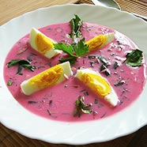

Ingredients
===========

* 250ml of beet sourdough or fresh cucumbers sourdough
* 250ml of sour cream
* 500ml of yoghurt
* 1 medium beetroot
* 1 bunch of dill
* 1 bunch of chives
* 1 cucumber
* 1 bunch of red radishes
* 1 pinch of powdered sugar
* salt
* pepper
* a few hard-boiled eggs

Preparation
===========

Mix 250ml of beet or cucumbers sourdough with 250ml of sour cream and 500ml of yogurt.

Time to make chlodnik soup pink coloured - we need some fresh beet juice. Most probably you can't buy it in grocery. Since beetroot is more like a potato, than a juicy fruit, electrical juicer cannot be overestimated :) I should mention salutary effect, that a red beetroot juice has on your health.

Add some salt to taste, and do not forget a pinch of powdered sugar. Soup should be gently but firmly sour.

Vegetables: add a big bunch of finely chopped dill and a small bunch of finely chopped chives.

Peel one fresh, green cucumber and dice it. Cut a bunch of red radishes into slices. Both diced cucumber and sliced radishes are another necessary addition to chlodnik.

Chlodnik should be left to 'mature' in a cool place for 2-3 hours (put it into your fridge).

When ready, serve chlodnik in bowls with a hard boiled egg, cut into quarters. Both eggs and chlodnik should be cold.

Notes
=====

Some people like to add small pieces of good quality cold cuts, or roast veal. For sure, there's a reason if chlodnik is going to be served as a main dish. Therefore it should has some more sustenance. More exquisite addition is a cooked shrimp, but it isn't Polish tradition at all. And remember that chlodnik should always be served cold (almost directly from your fridge).
