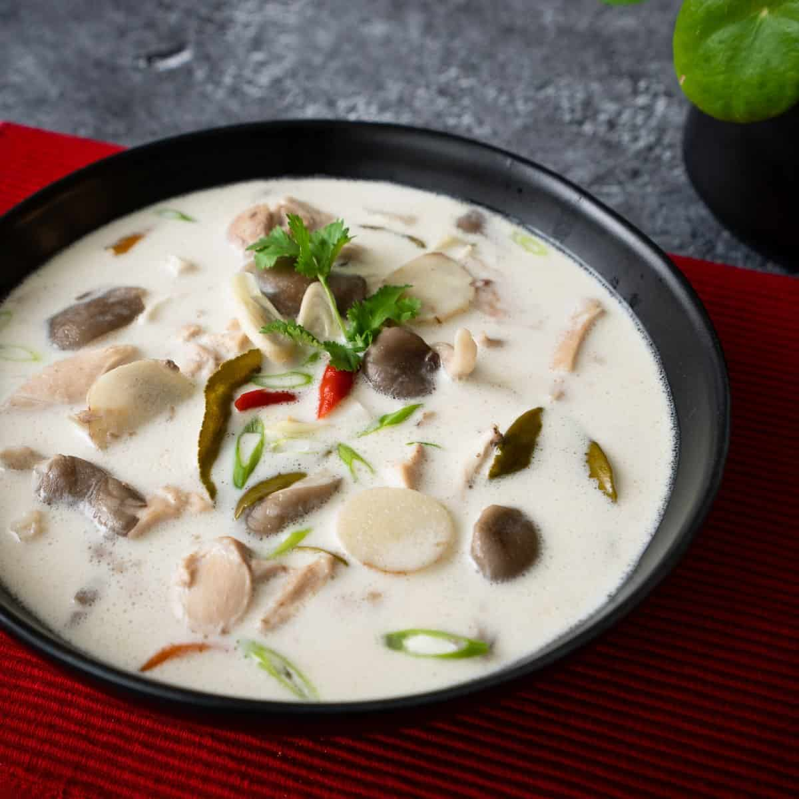

Comforting Thai chicken soup enriched with coconut milk and infused with 
lemongrass, galangal and makrut lime leaves.

Ingredients
===========

* 480ml chicken stock, unsalted, preferably homemade
* 350ml coconut milk
* 5gr kosher salt, or half the amount of table salt
* 450gr chicken thigh, boneless skinless, bite-sized pieces
* 1 stalk lemongrass, bottom half only, smashed and cut into 2-inch pieces
* 10 slices galangal
* 5 makrut lime leaves, roughly torn into big chunks, center stems removed
* 3 Thai chilies, bruised or cut into large pieces
* 30ml fish sauce
* 5gr finely chopped palm sugar, or granulated sugar
* 150gr oyster mushrooms
* 37.5ml lime juice
* 1 chopped green onion and/or cilantro, for garnish
* jasmine rice, for serving

Preparation
===========

1. Bring chicken stock to a boil, then add salt and chicken. Let simmer gently 
   for 15-20 minutes or until chicken is fork tender.
2. Add coconut milk, lemongrass, galangal, makrut lime leaves, chilies, about 
   half of the fish sauce, and sugar. Simmer for 5 minutes to infuse.
3. Add the mushrooms, bring back to a simmer, and cook for 1-2 minutes or until 
   cooked through.
4. Taste and add more fish sauce as needed. Turn off the heat and add 2 
   tablespoon of the lime juice, then taste and add more as needed. Top with 
   green onions and/or cilantro.
5. Serve with jasmine rice as part of a larger Thai meal, or you can put rice 
   in the soup and enjoy on its own. (Note: the herbs are for infusion only and 
   are not meant to be eaten. Either remove them before serving or inform your 
   guests.)

Notes
=====

1. If using chicken breast, cut into ½-inch thick slices and marinate in 1 
   tablespoon of fish sauce while you're prepping. Skip step #1 as chicken 
   breast does not need to be simmered and is best cooked only briefly, and 
   omit the salt. Reduce the chicken stock to 1 ½ cups and add it at step #2. 
   Add the chicken breast to the soup at the end along with the mushrooms in 
   step #3 and cook for a couple of minutes just until the chicken is done. Be 
   sure to taste and adjust the salt at the end!
2. The lemongrass, galangal and makrut lime leaves are meant for infusion only 
   and not meant to be eaten. Please inform your guests or remove them before 
   serving.
