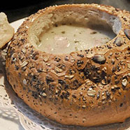

Ingredients
===========

For the Rye Sourdough:

* 120gr wholemeal rye flour 
* peel of one slice of wholemeal bread (which is not obligatory)
* 240ml room-temperature, but previously boiled water
* 2 cloves of slightly crushed garlic
* 2 bay leaves
* 2-3 allspice berries

For the Zurek soup:

* wloszczyzna: 1 carrot, half of a parsley, quarter of a leek, and small piece of a raw celery root
* 2 medium sized onions
* 2 garlic cloves
* 5 allspice berries
* 2 bay leaves
* 1-2 juniper berries (optional)
* 3 medium sized potatoes
* 240ml rye sourdough
* 250gr Polish raw sausage (white sausage)
* 100gr smoked bacon (optional) 
* 2-3tsp marjoram
* salt
* pepper
* 4-5tbsp sour cream (~18% fat)
* hard boiled eggs

Preparation
===========

### Rye Sourdough

Boil water and use it to rinse an interior of the glass or clay jar. Set aside to cool. When water reaches room temperature, add wholemeal rye flour to the jar and pour water. Stir the mixture to form a uniform slurry. Add spices – 2 cloves of slightly crushed garlic, 2 bay leaves, 2-3 allspice berries and the peel of one slice of wholemeal bread.

Cover the jar with a piece of gauze or linen cloth. Do not close it with the lid, since the sourdough needs some fresh air. Set aside for about 3-5 days in a warm place and give it a stir just once a day. Let it mature and the sourdough will gain a distinct sour smell and taste.

Now, your sourdough is ready to be used for the soup. Store any leftover in the refrigerator, in a closed glass jar or bottle.

### Zurek Soup

Wash, peel and cut 2 medium sized onions and wloszczyzna (1 carrot, half of a parsley, quarter of a leek, and small piece of a raw celery root). Put them into a large pot and cover with water. Add garlic (2 peeled cloves), 5 allspice berries, 2 bay leaves and, optionally, 1-2 juniper berries. Boil gently for about one hour, then drain the vegetables and save the broth.

In the meantime, wash, peel and dice 3 medium sized potatoes.

Now, add the rye sourdough (prepared according to the above recipe) to your vegetable broth (now without vegetables). Stir both ingredients and boil for about 5 minutes.

Cut the Polish raw sausage (white sausage) into thick slices. Usually, we add the sausage to the soup as is, but you can also fry it a bit on the frying pan.

To the soup (broth+sourdough mix), add 2-3 marjoram, sausage slices and smoked bacon (the latter is optional).

Cook the soup until it gets an intense aroma of meat and herbs. Add salt and pepper to taste, then turn the heat off. Add sour cream (~18% fat) and previously boiled potatoes. Stir the soup, but do not boil it any longer.

Serve while still hot, with cut in half hard boiled eggs (one egg per plate).

Notes
=====

